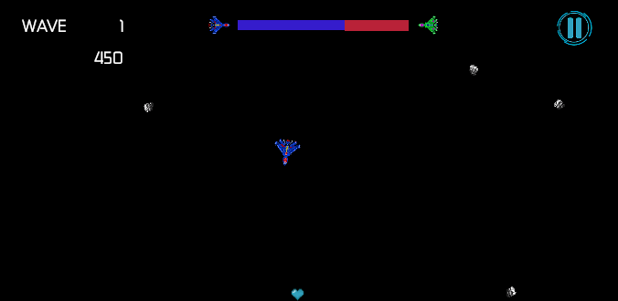

# Partes referentes ao desenvolvimento da comunicação em redes

## Servidor
- **Caminho:** `Server TCP/Server TCP/Program.cs`

## Jogo
- **Caminho:** `Assets/Scripts/ClientTCP.cs`

# Desenvolvimento de jogo multiplayer com Sockets TCP

Este relatório apresenta o desenvolvimento do jogo Asteroids Online, um jogo online multiplayer criado utilizando a engine Unity e comunicação baseada em sockets TCP. O projeto combina conceitos de programação para jogos e redes, oferecendo uma experiência competitiva e dinâmica para os jogadores.

No Asteroids Online, cada jogador escolhe uma nave e participa de uma partida em seu respectivo mapa, enfrentando ondas de asteroides. A competição é mediada por uma barra de progresso que indica o percentual de asteroides abatidos por cada jogador. Essa barra é dividida em duas seções: uma para o jogador aliado e outra para o jogador inimigo.

O jogo incentiva a competitividade através de mecânicas adaptativas. Quando um dos jogadores ultrapassa o outro em 20% no abate de asteroides, asteroides adicionais, marcados com a cor vermelha, começam a surgir no mapa do jogador em desvantagem. Isso adiciona um elemento de estratégia ao jogo, tornando-o mais desafiador e equilibrado.

  

  <em>Tela do jogador 1</em>

  

  <em>Tela do jogador 2</em>

A implementação do Asteroids online destaca o uso de sockets TCP para gerenciar a comunicação entre os clientes e o servidor, garantindo a sincronização das ações e eventos durante as partidas. Este relatório detalha as etapas de desenvolvimento, desde a concepção da ideia até a implementação técnica, abordando os desafios e soluções encontrados ao longo do processo.

# Tipos de mensagens

- YI - Your ID: Usada para o servidor enviar ao jogador conectado o seu ID
- NP - New Player: Notifica outros jogadores sobre o id de um novo jogador
- Ship: Nave selecionada pelo jogador (e com isso o servidor notifica a todos)
- Ready: enviada pelo jogador (cliente) quando o botão play é clicado
- Start: enviada pelo servidor para que o jogo seja iniciado simultaneamente
- TA - Contagem total de asteroides: enviada pelos jogadores ao servidor conforme seus asteroides são gerados. 
- AC - Contagem dos asteroides abatidos: enviada pelos jogadores ao servidor conforme os asteroides são quebrados 
-Over: Enviada para o servidor quando o jogador perde o jogo.

# Diagrama de sequência

  

  <em>Diagrama de sequência</em>

